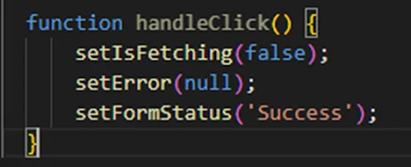

https://www.youtube.com/watch?v=MJn5_uU10xc
https://www.youtube.com/watch?v=PnmA3tWKlaA


🚀 Prepare-se enquanto lhe mostro como seus projetos web a novos patamares. Seja para interações perfeitas, tempos de resposta ultra-rápidos ou simplesmente uma imersão profunda no mundo dinâmico do React, este artigo tem tudo para você.


# Unleash the Power of React JS: Effortless Performance Boost and Insider Tips

Estudando performance with react js

## Table of Content

- [What is ReactJs?](#s0)
- [How to check react app performance state?](#s1)
- [How React Works? Why the things happen in react?](#s2)
  - [What's Fiber and keys? The algorithm behind React](#s2-1)
  - [Automatic batching (new in React 18)](#s2-2)
  - [Find a performance Issue Exercise](#s2-3)
- [React PureComponents](#s3)
- [Minimizing unnecessary updates (Reducing Rerenders)](#s4)
  - [Pushing state down with exercise](#s4-1)
  - [Pulling Content Up with children](#s4-2)
  - [Shallow comparing](#s4-3)
  - [Memoization Hooks](#s4-4)
    - [use(Memo | Callback)](#s4-4-1)
    - [useReducer & dispatch](#s4-4-2)
- [Context API](#s4-5)
- [use(Transition | DeferredValue)](#s4-6)
- [Conclusion](#conclusion)
- [About the Author](#about-the-author)
- [References](#references)

## What is ReactJS? <a name="s0"></a>

I'm assuming that if you are here it because you already knows what is **reactjs**. So this may sound repetitive but will make sense.

Caring on **React.js** is a JavaScript library for building user interfaces [React Doc](https://react.dev/). It allow us to build complex UIs by breaking them down into reusable components.

It's in the process of breaking A Whole into a small peace where we usually make a lot of mistakes that can affect the performance of ou application, 'cause sometimes we don't know where a certain state should be, how it should be, what a component should do or contain, and so on.

And to avoid this what we can do is simply understand how react works and nothing more.

So show to you some techniques that I learned that will help you when you will build your react application, to ensure that your app is performed.

## How to check react app performance state? <a name="s1"></a>

Before diving into optimization techniques, it's essential to understand how to assess the performance state of a React application. React provides several tools to measure and analyze performance:


**React Developer Tools**: This browser extension (available for Chrome and Firefox) is a must-have for React developers. It allows you to inspect the component hierarchy, view props and state, and analyze performance by recording and inspecting render times. [How to Use React Dev Tools – With Example Code and Videos](https://www.freecodecamp.org/news/how-to-use-react-dev-tools/)


**Performance Profiling**: React offers a built-in profiling API that enables you to measure the rendering time of components. By wrapping the desired component with the Profiler component, you can collect performance information and identify potential bottlenecks.[Profiling Performance of React Apps using React Profiler](https://blog.bitsrc.io/profiling-performance-of-react-apps-using-react-profiler-d02d77f3c96a)


## How React Works? Why the things happen in react? <a name="s2"></a>

It's hard to optimize something in React if we doesn't know how React works, 'cause as I said perform in react means understanding how react works.

React.js is a powerful JavaScript library that revolutionized the way we build user interfaces. To truly optimize performance in React, it's essential to understand how it works and why certain things happen within the library.

So, at its core, React follows a component-based architecture, where the UI is broken down into reusable components as mentioned previously. These components can have their own state, props, and rendering logic. When the state or props of a component change, React efficiently updates the user interface to reflect these changes.

React's efficient updates are thanks to its use of a virtual DOM (VDOM). The virtual DOM is a lightweight copy of the actual DOM that React creates and manages. When changes occur in a React component, React compares the previous and current versions of the virtual DOM to identify what needs to be updated. [React Virtual DOM: The Key to Efficient and Optimized Web Development](https://javascript.plainenglish.io/react-virtual-dom-the-key-to-efficient-and-optimized-web-development-538f6c502389)


This may generate questions like: **How react optimizes VDOM updates?**. This thanks to React's **reconciliation algorithm**, known as the Diffing algorithm, that is responsible for determining the minimal set of changes needed to update the actual DOM. It compares the previous and current virtual DOM trees and calculates the differences, or "diffs," between them. This process Optimizing the rendering and minimizing expensive DOM manipulations.
[REACT RECONCILIATION ALGORITHM](https://medium.com/javarevisited/react-reconciliation-algorithm-86e3e22c1b40#id_token=eyJhbGciOiJSUzI1NiIsImtpZCI6IjYwODNkZDU5ODE2NzNmNjYxZmRlOWRhZTY0NmI2ZjAzODBhMDE0NWMiLCJ0eXAiOiJKV1QifQ.eyJpc3MiOiJodHRwczovL2FjY291bnRzLmdvb2dsZS5jb20iLCJuYmYiOjE2ODU5MDkwMjYsImF1ZCI6IjIxNjI5NjAzNTgzNC1rMWs2cWUwNjBzMnRwMmEyamFtNGxqZGNtczAwc3R0Zy5hcHBzLmdvb2dsZXVzZXJjb250ZW50LmNvbSIsInN1YiI6IjEwNDA3NzY5MjQ1MzU4MzM5OTM4MCIsImVtYWlsIjoiZGFsY2lvbWFjdWV0ZWdhcmNpYUBnbWFpbC5jb20iLCJlbWFpbF92ZXJpZmllZCI6dHJ1ZSwiYXpwIjoiMjE2Mjk2MDM1ODM0LWsxazZxZTA2MHMydHAyYTJqYW00bGpkY21zMDBzdHRnLmFwcHMuZ29vZ2xldXNlcmNvbnRlbnQuY29tIiwibmFtZSI6IkTDoWxjaW8gTWFjdWV0ZSBHYXJjaWEiLCJwaWN0dXJlIjoiaHR0cHM6Ly9saDMuZ29vZ2xldXNlcmNvbnRlbnQuY29tL2EvQUFjSFR0ZUM3RURSa3FEUnB3ZkNjUVFocXU1NXMtVk9zaEpWWlE1TW1ManBMQT1zOTYtYyIsImdpdmVuX25hbWUiOiJEw6FsY2lvIE1hY3VldGUiLCJmYW1pbHlfbmFtZSI6IkdhcmNpYSIsImlhdCI6MTY4NTkwOTMyNiwiZXhwIjoxNjg1OTEyOTI2LCJqdGkiOiIzMzE1MTM2MmEwMjRkMDNmNGVjZjUxNGFkZGNmMmMyNWQ3ODNmOGVlIn0.WjEHs5EKywxfJQwkK3GeSDpsZSR1mEv51XIlnEoGbeUNfsgcepaJatyFCCocfkR4LnSnHYttJ2DPI0dEmXmlFa8b_kJSB4s23ZPiMMpRXhD4Z7fvpkWXtRWGlOhTa0AAoKYrnEP6cenx1DQSxJWiHdJErdMQ3U9OxdOQoGt2QYHFYhuxFMH3sbJTsma7xYHCwxbY_wLmfRzpAGAoUiwS9s6Wam5Z_91RGzbqpOrcYJiD_f__VNJ5Eh1tEJlGbCJej1Ebx27Val_dVjSyuWpN9UlZ8Upy24eBbSdtONIM3rgciunHJwHpDacidLHeUKzfLLBuasmRTZu4i06O3YrpcQ)


Instead of directly manipulating the actual DOM for every change, React applies the calculated diffs to the virtual DOM first. It then efficiently updates the actual DOM with the minimal number of changes required, resulting in improved performance.

React also introduces the concept of "reconciliation" during this process. When comparing the virtual DOM trees, React not only identifies the differences but also handles the addition, removal, or reordering of components. This ensures that the UI accurately reflects the changes made to the state or props of the components.

Additionally, React utilizes a concept called "keys" to optimize rendering. Keys are unique identifiers assigned to components within an array. When components are added, removed, or reordered, React uses these keys to track and reuse existing DOM elements whenever possible. This optimization minimizes unnecessary re-renders and improves performance.

React's unidirectional data flow is another crucial aspect of how it works. Data flows in a single direction, from parent components to child components. When the state of a parent component changes, it triggers a re-render of the parent and its child components. This allows React to efficiently update only the necessary parts of the UI.

By understanding how React works under the hood, you can make informed decisions about component structure, state management, and optimization techniques. And remember, that React's goal is to minimize unnecessary DOM manipulations, optimize rendering, and provide a smooth user experience.

### What's Fiber and Keys? The Algorithm Behind React <a name="s2-1"></a>

**Fiber reconciler** is the algorithm behind React, it provides greater flexibility and control over the rendering process. Fiber is responsible to organize the components into a tree structure and implements a priority-based algorithm to schedule and execute updates efficiently.

The primary goal of React Fiber is to enable incremental rendering, which means breaking down the rendering process into small units of work called "fibers." Each fiber represents a component and its state. With React Fiber, the rendering work can be paused, resumed, or even canceled in the middle of the process, allowing React to respond to user interactions more quickly.

Here are some key features and benefits of React Fiber:

- **Incremental rendering**: React Fiber allows rendering to be split into multiple smaller chunks, which can be spread over multiple frames. This approach improves the overall responsiveness of the application, especially for complex UIs.

- **Better scheduling**: React Fiber introduces a new priority-based scheduling algorithm. It enables React to prioritize and schedule the rendering work according to the importance and urgency of the tasks, resulting in a smoother user experience.

- **Error boundaries**: React Fiber improves error handling by introducing the concept of error boundaries. Error boundaries are special components that catch errors in their child components and prevent the entire component tree from being unmounted due to a single error.

- **Improved performance**: By optimizing the reconciliation algorithm and introducing asynchronous rendering, React Fiber improves the performance of React applications. It ensures that the UI stays responsive, even when performing computationally intensive operations or handling large amounts of data.

- **Concurrent mode**: React Fiber introduces the concept of concurrent mode, which allows rendering work to be interrupted and resumed. This is particularly useful for creating responsive user interfaces, as it ensures that the application remains interactive even during expensive rendering operations.

**Note** that as a developer, you don't interact directly with React Fiber, but you benefit from its improved performance and concurrency features when using React.

### Automatic Batching (New in React 18) <a name="s2-2"></a>

**Automatic batching** is a new feature introduced in React 18 that enhances performance by batching multiple state updates into a single render cycle, 'Cause in earlier versions of React, updating state multiple times within a single event handler or lifecycle method could lead to unnecessary re-renders. Automatic batching addresses this issue, resulting in improved performance and reduced rendering overhead.



### Find a Performance Issue Exercise <a name="s2-3"></a>

To solve performance issues we should know at first where there are. Let's take a look at an exercise to find and address a performance problem:

```jsx
import { useState } from "react";

const Counter = () => {
  const [count, setCount] = useState(0);

  const increment = () => {
    setCount(count + 1); // wrong ❌
  };

  return (
    <div>
      <p>Count: {count}</p>
      <button onClick={increment}>Increment</button>
    </div>
  );
};

export default Counter;
```

I this example we have a very common mistake in: _setCount(count + 1);_, the way that we're trying to update the state could lead us to unexpected behivour. What happens is that every time the button is clicked, the increment function is called, triggering a state update and a re-render of the component. This can lead to unnecessary renders, degrading the performance. And when we want to update a state with his previous value we should pass a callback in the _`setState`_ that returns a new value derived from the previous.

To fix this issue, you should modify the increment function to use the functional form of the setCount state update function. And in addittion we can utilize the useCallback hook to memoize the increment function and prevent it from being recreated on each render:

```jsx
import { useState, useCallback } from "react";

const Counter = () => {
  const [count, setCount] = useState(0);

  const increment = useCallback(() => {
    // Addition ➕
    setCount((prevCount) => prevCount + 1); // correct ✔️✅
  }, []); /* By using useCallback with an empty dependency array,
 we ensure that the increment function is memoized and remains
  the same across renders as long as its dependencies don't change.
 This optimization eliminates unnecessary function recreations and
 improves the performance of the component.*/

  return (
    <div>
      <p>Count: {count}</p>
      <button onClick={increment}>Increment</button>
    </div>
  );
};

export default Counter;
```

To find perfermonce issues in React we can consider some points such:

### Examples of Finding Performance Issues in React <a name="s2"></a>

- **Inefficient rendering or excessive re-renders**: This occurs when components re-render more frequently than necessary, leading to unnecessary computational overhead. It can happen due to improper usage of React's lifecycle methods, incorrect dependencies in `useEffect` or `useMemo` hooks, or inefficient state management.

- **Large component trees**: Having deeply nested component structures can impact performance. Rendering a large number of components, especially with complex UIs, can result in slower rendering times and decreased performance. Consider optimizing the component structure by breaking it down into smaller, more manageable components or implementing virtualization techniques like `react-virtualized` or `react-window` to render only the visible portions of a large list or grid.

- **Unoptimized list rendering**: When rendering long lists of data, inefficient rendering approaches can degrade performance. For instance, using array index as a `key` prop can lead to inefficient re-renders. Instead, use unique and stable identifiers for keys. Additionally, consider implementing techniques like pagination or infinite scrolling to fetch and render data in smaller chunks instead of rendering the entire list at once.

- **Expensive calculations or computations**: Performing computationally intensive operations within render methods, event handlers, or hooks can negatively impact performance. Evaluate if these calculations can be moved to more optimized locations, such as memoized selectors or `useMemo`/`useCallback` hooks, to avoid redundant calculations on every render.

- **Inefficient handling of large data sets**: Handling large amounts of data inefficiently can lead to performance issues. For example, rendering and manipulating large arrays or objects directly in the render phase can cause slow rendering and unresponsive user interfaces. Consider optimizing data handling techniques, such as implementing pagination, virtualization, or using memoization to prevent unnecessary re-renders.

- **Improper use of third-party libraries**: Some third-party libraries may introduce performance issues if used improperly. For example, using a library that performs heavy computations or updates frequently without optimization can impact your app's performance. Ensure that you understand and utilize the recommended practices and optimizations provided by the library to mitigate any potential performance problems.

These are just a few examples of performance issues you might encounter in React applications. It's crucial to profile, measure, and analyze your application's performance using appropriate tools and techniques to identify and address any bottlenecks or inefficiencies specific to your codebase.

## React PureComponents <a name="s3"></a>

React provides a special component called **PureComponent** that implements a shallow prop and state comparison to determine whether a component needs to re-render. When using PureComponent, React automatically performs the shallow comparison and avoids re-rendering if the props and state remain the same.

And in React there several ways to implement _Pure Components_, and the the most common way is creating a class component that extends Pure component, follow the example:

```jsx
import React, { PureComponent } from "react";

class DisneyCharacter extends PureComponent {
  render() {
    const { name, animation } = this.props;
    return (
      <div>
        <p>Name: {name}</p>
        <p>Is from: {animation}</p>
      </div>
    );
  }
}
```

We can achieve this with functional programming by using _memo_ to memoize our component and decides wheater should re-render or not. FOllow the example:

```jsx
import React, { memo } from "react";

const DisneyCharacter = memo((props) => {
  const { name, animation } = props;

  return (
    <div>
      <p>Name: {name}</p>
      <p>Is from: {animation}</p>
    </div>
  );
});
```

## Minimizing Unnecessary Updates (Reducing Rerenders) <a name="s4"></a>

To optimize React components further, it's crucial to minimize unnecessary updates and avoid re-rendering when it's not required. React provides several techniques to achieve this goal:

1. **Using shouldComponentUpdate**

The concept of **shouldComponentUpdate** can be translated using the React.memo higher-order component or the useMemo hook to optimize re-renders of functional components. Here's how you can achieve this:

```jsx
import React, { memo } from "react";

const DisneyCharacter = memo(
  (props) => {
    const { name, animation } = props;

    return (
      <div>
        <p>Name: {name}</p>
        <p>Is from: {animation}</p>
      </div>
    );
  },
  (prevProps, nextProps) => {
    // Custom comparison logic
    return (
      prevProps.name === nextProps.name &&
      prevProps.animation === nextProps.animation
    );
  }
); // this callback is optional
```

The previous component memoizes the component and just re-render if one of its props has changed. By passing a callback we are verifying if one of the props has changed. If the return is **true** the component won't re-render.

We can do something similar by using **useMemo**, a memoizantion hook such:

```jsx
import React, { useMemo } from "react";

const DisneyCharacter = ({ name, animation }) => {
  // Component rendering logic

  // Memoize the component with props comparison
  const memoizedComponent = useMemo(
    () => (
      <div>
        <p>Name: {name}</p>
        <p>Is from: {animation}</p>
      </div>
    ),
    [name, animation]
  );

  return memoizedComponent;
};
```

In this approach, the _useMemo_ hook is used to memoize the rendering of the component. It takes a function as the first argument, which returns the JSX markup. The second argument is an array of dependencies that determine when the memoized component should update. In this case, the component will only update if the _name_ or _animation_ props change.

Both approaches allow you to optimize re-renders of functional components by implementing a custom comparison logic to determine whether the component should update. This enables you to achieve similar functionality as shouldComponentUpdate

### Pushing State Down with Exercise <a name="s4-1"></a>

One of the issue about performance in react, are caused by the way that we structure our state.

In React, pushing state down refers to moving the state management to the lowest possible component in the component hierarchy. This practice reduces the number of components that need to re-render when a state update occurs.

Consider the following example:

```jsx
const App = () => {
  const [count, setCount] = useState(0);

  const increment = () => {
    setCount((count) => count + 1);
  };

  return (
    <div>
      <Counter count={count} increment={increment} />
      <OtherComponent />
    </div>
  );
};

const Counter = ({ counter, increment }) => {
  return (
    <div>
      <p>Count: {count}</p>
      <button onClick={increment}>Increment</button>
    </div>
  );
};
```

In this case, the _count_ state is managed in the _App_ component, and both the Counter and _OtherComponent_ components receive it as props. However, when the _increment_ function is called and updates the state, both components will re-render, even if _OtherComponent_ doesn't depend on the _count_ state.

To optimize this scenario, we can push the state down to the _Counter_ component:

```jsx
const App = () => {
  return (
    <div>
      <Counter count={count} increment={increment} />
      <OtherComponent />
    </div>
  );
};

const Counter = () => {
  const [count, setCount] = useState(0);

  const increment = () => {
    setCount((count) => count + 1);
  };

  return (
    <div>
      <p>Count: {count}</p>
      <button onClick={increment}>Increment</button>
    </div>
  );
};
```

By moving the state and the increment function to the _Counter_ component, we ensure that only the _Counter_ component re-renders when the state is updated, minimizing unnecessary re-renders in other components.

### Pulling Content Up with Children <a name="s4-2"></a>

Although React encourages component composition and reusability, sometimes components end up rendering static content that doesn't change between instances. In such cases, pulling the static content up to a parent component can optimize performance by reducing the number of unnecessary renders.

Consider the following example:

```jsx
const App = () => {
  const [count, setCount] = useState(0);

  const increment = () => {
    setCount((count) => count + 1);
  };

  return (
    <div>
      <ComponentsContainer count={count} increment={increment} />
      <Chart count={count} />
    </div>
  );
};

const ComponentsContainer = ({ count, increment }) => {
  return (
    <div>
      <p>ComponentContainer</p>
      <ChildComponent />
      <Counter count={count} increment={increment} />
      <ChildComponent />
    </div>
  );
};

const ChildComponent = () => {
  return (
    <div>
      <p>Static Content</p>
    </div>
  );
};

const Counter = ({ counter, increment }) => {
  return (
    <div>
      <p>Count: {count}</p>
      <button onClick={increment}>Increment</button>
    </div>
  );
};
```

We can make this better by doing:

```jsx
const App = () => {
  const [count, setCount] = useState(0);

  const increment = () => {
    setCount((count) => count + 1);
  };

  return (
    <div>
      <ComponentsContainer>
        <Counter count={count} increment={increment} />
      </ComponentsContainer>
      <Chart count={count} />
    </div>
  );
};

const ComponentsContainer = ({ children }) => {
  return (
    <div>
      <p>ComponentContainer</p>
      <ChildComponent />
      {children}
      <ChildComponent />
    </div>
  );
};

const ChildComponent = () => {
  return (
    <div>
      <p>Static Content</p>
    </div>
  );
};

const Counter = ({ counter, increment }) => {
  return (
    <div>
      <p>Count: {count}</p>
      <button onClick={increment}>Increment</button>
    </div>
  );
};
```

In this updated example, the static content is rendered once in the ParentComponent, eliminating unnecessary re-renders in the ChildComponent.

### Shallow comparing <a name="s4-3"></a>

Shallow comparing is a technique used to optimize React components by avoiding deep comparisons of props and state. Instead of performing deep equality checks, shallow comparing compares the references of objects or primitive values. This optimization can significantly reduce the overhead of comparisons, especially for large objects or arrays.

The following example, show shallow comparing with the _React.memo_ HOC:

```jsx
const DisneyCharacter = React.memo(({ data }) => {
  // Perform shallow comparing on data object properties
  // ...

  return <div>{/* Render component */}</div>;
});
```

In this example, the _DisneyCharacter_ component can perform shallow comparing on the properties of the _data_ object to determine if a re-render is necessary. By avoiding deep equality checks, the component can improve performance.

### Memoization Hooks <a name="s4-4"></a>

Memoization hooks, such as **useMemo** and **useCallback**, are powerful tools for optimizing React components by memoizing expensive calculations or functions. These hooks allow you to cache and reuse the results of calculations or function references, avoiding redundant computations and re-renders.

1. **useMemo** <a name="s4-4-1"></a>

The **useMemo** hook memoizes the result of a computation and returns the cached value on subsequent renders. It takes a dependency array as the second argument to determine when to recalculate the memoized value. Here's an example:

```jsx
const ExpensiveComponent = () => {
  const expensiveResult = useMemo(() => {
    // Expensive computation
    // ...
    return result;
  }, [dep1, dep2]);

  return <div>{/* Render component */}</div>;
};
```

2. **useCallback** <a name="s4-4-2"></a>

The **useCallback** hook memoizes a function reference and returns the memoized function. It's useful when passing callbacks to child components to prevent unnecessary re-renders of those components. Here's an example:

```jsx
const ParentComponent = () => {
  const handleClick = useCallback(() => {
    // Handle click event
  }, []);

  return <ChildComponent onClick={handleClick} />;
};
```

## Context API <a name="s4-5"></a>

The Context API in React provides a way to share data between components without passing props manually at each level. While the Context API offers convenience, it's essential to be mindful of its impact on performance. Large context providers or frequent updates to context values can cause unnecessary re-renders in consuming components.

To optimize the performance of the Context API, consider the following tips:

- **Keep the context value small**: Avoid passing large objects or arrays as context values since any changes to them will trigger re-renders in consuming components.
- **Use memoization**: Memoize context values using techniques like useMemo to prevent re-renders when the context value remains the same.
- **Limit provider scope**: Wrap only the necessary components with the context provider to minimize the number of components affected by context updates.

```jsx
import React, { createContext, useContext, useMemo } from "react";

// Step 1: Create a small context value
const UserContext = createContext();

// Step 2: Create a provider component
const DisnerCharacterProvider = ({ children }) => {
  // Simulating a large context value
  const user = useMemo(
    () => ({
      id: 1,
      name: "Mickey Mouse",
      email: "mickey.mousee@disney.com",
      animation: "Mickey Mouse Clubhouse",
      // ... other properties
    }),
    []
  );

  return <UserContext.Provider value={user}>{children}</UserContext.Provider>;
};

// Step 3: Create a consuming component
const UserInfo = () => {
  // Step 4: Use useContext to access the context value
  const user = useContext(UserContext);

  // Step 5: Memoize the component to prevent re-renders when context value doesn't change
  return useMemo(
    () => (
      <div>
        <h2>User Info</h2>
        <p>Name: {user.name}</p>
        <p>Email: {user.email}</p>
        <p>It's from: {user.animation}</p>
      </div>
    ),
    [user]
  );
};

// Step 6: Wrap necessary components with the context provider
const App = () => {
  return (
    <div>
      <h1>My App</h1>
      <DisnerCharacterProvider>
        <div>
          <h2>Disney Characters</h2>
          <UserInfo />
          {/* Other components that will need context */}
        </div>
      </DisnerCharacterProvider>
      {/* Other components that won't need context */}
    </div>
  );
};
```

## use(Transition | DeferredValue) <a name="s4-6"></a>

In React 18, two new features have been introduced to improve the performance and user experience of asynchronous rendering: **useTransition** and **useDeferedValue**

1. **useTransition**

The **useTransition** hook allows you to create smooth transitions during state updates, particularly useful for handling loading states and asynchronous operations. By using useTransition, you can control how long React should wait before displaying loading spinners or placeholders during state transitions.

```jsx
const App = () => {
  const [isPending, startTransition] = useTransition();
  const [data, setData] = useState(null);

  const fetchData = () => {
    startTransition(() => {
      // Show loading spinner during the transition
      const fetchedData = fetchDataFromServer();
      setData(fetchedData);
    });
  };

  return (
    <div>
      {isPending ? <LoadingSpinner /> : <DataComponent data={data} />}
      <button onClick={fetchData}>Fetch Data</button>
    </div>
  );
};
```

During the transition, the loading spinner will be displayed, improving the user experience.

2. **useDeferedValue**

**useDeferredValue** is a React hook introduced in React 18 that allows you to delay the update of a value in your component. It helps improve performance by deferring the update of a value until the next render cycle, allowing React to prioritize more urgent updates first.

The primary use case for useDeferredValue is when you have a value that is not immediately needed for rendering or user interactions. By deferring its update, you can prevent it from causing unnecessary work and potential performance issues.

Here's an example to illustrate the usage of useDeferredValue:

```jsx
import React, { useState, useDeferredValue } from "react";

const App = () => {
  const [count, setCount] = useState(0);
  const deferredCount = useDeferredValue(count);

  const increment = () => {
    setCount((count) => count + 1);
  };

  return (
    <div>
      <p>Count: {count}</p>
      <p>Deferred Count: {deferredCount}</p>
      <button onClick={increment}>Increment</button>
    </div>
  );
};
```

Here:

1. We have a state variable _count_ that is incremented by clicking the "Increment" button.
2. We use _useDeferredValue_ to create a deferred value _deferredCount_ based on the _count_ state.
3. The _timeoutMs_ option is set to _1000 milliseconds (1 second)_, indicating that the update of _deferredCount_ will be deferred for at least 1 second.
4. The _count_ is rendered immediately, while the _deferredCount_ will reflect the value of _count_ from the previous render cycle until the timeout elapses.
5. This allows React to prioritize other updates before updating the _deferredCount_, preventing it from causing unnecessary rendering or blocking user interactions.
6. By using _useDeferredValue_, you can optimize your components by deferring less critical updates, ensuring a smoother user experience and better performance by prioritizing more important updates.

## Conclusion <a name="conclusion"></a>

In this comprehensive guide, we have explored various techniques and best practices for optimizing the performance of React applications. We started by understanding how to check the performance state of a React app, enabling us to identify areas that need improvement.

We delved into how React works internally, gaining insights into the virtual DOM, reconciliation process, and the role of Fiber and keys in optimizing rendering performance. With this understanding, we can make informed decisions and leverage React's algorithms to ensure efficient updates and minimize unnecessary re-renders.

The introduction of automatic batching in React 18 has been a significant milestone in performance optimization. By automatically combining multiple state updates into a single batch, React reduces the number of rendering cycles, resulting in improved performance and a smoother user experience. We learned how automatic batching works and explored practical examples where it can be applied effectively.

We also explored various techniques for minimizing unnecessary updates, such as using React PureComponents, pushing state down, pulling content up, and shallow comparing. These techniques help us optimize our components by reducing the number of re-renders and improving overall performance.

Memoization hooks, such as `useMemo` and `useCallback`, provide powerful tools for optimizing the performance of expensive calculations and preventing unnecessary re-execution of functions. We also discussed the Context API as a way to optimize data propagation and avoid unnecessary re-renders in deeply nested components.

Furthermore, React 18 introduced new features like `useTransition` and `useDeferredValue`. `useTransition` allows us to create smooth transitions during state updates, enhancing the user experience, while `useDeferredValue` allows us to defer the rendering of certain values until they are needed, optimizing the handling of large data sets and expensive computations.

Throughout the guide, we emphasized the importance of profiling, measuring, and testing our React applications to identify specific areas for improvement. We provided practical exercises and challenges to encourage readers to apply the concepts discussed in their own projects and gain hands-on experience with performance optimization.

Optimizing React application performance is an ongoing process. By implementing the techniques and best practices covered in this guide, such as automatic batching, minimizing unnecessary updates, leveraging memoization hooks, and using the new features in React 18, you can significantly improve the performance and user experience of your React applications.

Remember, each optimization technique has its own considerations, caveats, and trade-offs. It's crucial to evaluate their applicability based on your project's specific requirements and constraints. By continuously learning, experimenting, and staying updated with the latest advancements in React, you can build fast, efficient, and highly performant applications that delight users.

With the knowledge gained from this definitive guide for React performance, you are now equipped to tackle performance challenges head-on and create exceptional React applications that deliver optimal performance at scale.

## About The Author <a name="about-the-author"></a>

- Name: **Dálcio Garcia**
- Role: **Front End Developer**
- Github: [dalcio](https://github.com/dalcio)
- Linkedin: [Dálcio Macuete Garcia](https://linkedin.com/in/dalcio-garcia)
- Portfolio: [dalciogarcia](https://dalciogarcia.vercel.app)

## References <a name="references"></a>

- [An Introduction to React Fiber - The Algorithm Behind React](https://www.velotio.com/engineering-blog/react-fiber-algorithm)
- [What Is React Fiber? React.js Deep Dive #2](https://www.youtube.com/watch?v=0ympFIwQFJw)
-
