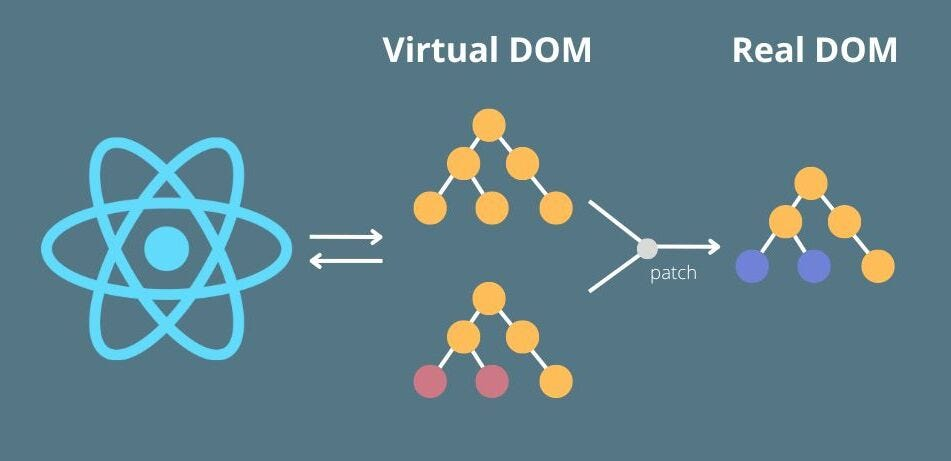

# React Js: The definitive guide for performance

Estudando performance with react js

## Table of Content

- [What is ReactJs?](#s0)
- [How to check react app performance state?](#s1)
- [How React Works? Why the things happen in react?](#s2)
  - [What's Fiber and keys? The algorithm behind React](#s2-1)
  - [Automatic batching (new in React 18)](#s2-2)
  - [Find a performance Issue Exercise](#s2-3)
- [React PureComponents](#s3)
- [Minimizing unnecessary updates (Reducing Rerenders)](#s4)
  - [Pushing state down with exercise](#s4-1)
  - [Pulling Content Up with children](#s4-2)
  - [Shallow comparing](#s4-3)
  - [Memoization Hooks](#s4-4)
    - [use(Memo | Callback)](#s4-4-1)
    - [useReducer & dispatch](#s4-4-2)
  - [Context API](#s4-5)
  - [use(Transition | DeferredValue)](#s4-6)
  - [Conclusion](#conclusion)

## What is ReactJS? 

I'm assuming that if you are here it because you already knows what is **reactjs**. So this may sound repetitive but will make sense.

Caring on **React.js** is a JavaScript library for building user interfaces [React Doc](https://react.dev/). It allow us to build complex UIs by breaking them down into reusable components.

It's in the process of breaking A Whole into a small peace where we usually make a lot of mistakes that can affect the performance of ou application, 'cause sometimes we don't know where a certain state should be, how it should be, what a component should do or contain, and so on.

And to avoid this what we can do is simply understand how react works and nothing more.

So show to you some techniques that I learned that will help you when you will build your react application, to ensure that your app is performed.

## How to check react app performance state? 

Before diving into optimization techniques, it's essential to understand how to assess the performance state of a React application. React provides several tools to measure and analyze performance:

**React Developer Tools**: This browser extension (available for Chrome and Firefox) is a must-have for React developers. It allows you to inspect the component hierarchy, view props and state, and analyze performance by recording and inspecting render times. [How to Use React Dev Tools – With Example Code and Videos](https://www.freecodecamp.org/news/how-to-use-react-dev-tools/)

**Performance Profiling**: React offers a built-in profiling API that enables you to measure the rendering time of components. By wrapping the desired component with the Profiler component, you can collect performance information and identify potential bottlenecks.[Profiling Performance of React Apps using React Profiler](https://blog.bitsrc.io/profiling-performance-of-react-apps-using-react-profiler-d02d77f3c96a)

## How React Works? Why the things happen in react?

It's hard to optimize something in React if we doesn't know how React works, 'cause as I said perform in react means understanding how react works.

React.js is a powerful JavaScript library that revolutionized the way we build user interfaces. To truly optimize performance in React, it's essential to understand how it works and why certain things happen within the library.

So, at its core, React follows a component-based architecture, where the UI is broken down into reusable components as mentioned previously. These components can have their own state, props, and rendering logic. When the state or props of a component change, React efficiently updates the user interface to reflect these changes.

React's efficient updates are thanks to its use of a virtual DOM (VDOM). The virtual DOM is a lightweight copy of the actual DOM that React creates and manages. When changes occur in a React component, React compares the previous and current versions of the virtual DOM to identify what needs to be updated. [React Virtual DOM: The Key to Efficient and Optimized Web Development](https://javascript.plainenglish.io/react-virtual-dom-the-key-to-efficient-and-optimized-web-development-538f6c502389)

This may generate questions like: **How react optimizes VDOM updates?**. This thanks to React's **reconciliation algorithm**, known as the Diffing algorithm, that is responsible for determining the minimal set of changes needed to update the actual DOM. It compares the previous and current virtual DOM trees and calculates the differences, or "diffs," between them. This process Optimizing the rendering and minimizing expensive DOM manipulations.
[REACT RECONCILIATION ALGORITHM](https://medium.com/javarevisited/react-reconciliation-algorithm-86e3e22c1b40#id_token=eyJhbGciOiJSUzI1NiIsImtpZCI6IjYwODNkZDU5ODE2NzNmNjYxZmRlOWRhZTY0NmI2ZjAzODBhMDE0NWMiLCJ0eXAiOiJKV1QifQ.eyJpc3MiOiJodHRwczovL2FjY291bnRzLmdvb2dsZS5jb20iLCJuYmYiOjE2ODU5MDkwMjYsImF1ZCI6IjIxNjI5NjAzNTgzNC1rMWs2cWUwNjBzMnRwMmEyamFtNGxqZGNtczAwc3R0Zy5hcHBzLmdvb2dsZXVzZXJjb250ZW50LmNvbSIsInN1YiI6IjEwNDA3NzY5MjQ1MzU4MzM5OTM4MCIsImVtYWlsIjoiZGFsY2lvbWFjdWV0ZWdhcmNpYUBnbWFpbC5jb20iLCJlbWFpbF92ZXJpZmllZCI6dHJ1ZSwiYXpwIjoiMjE2Mjk2MDM1ODM0LWsxazZxZTA2MHMydHAyYTJqYW00bGpkY21zMDBzdHRnLmFwcHMuZ29vZ2xldXNlcmNvbnRlbnQuY29tIiwibmFtZSI6IkTDoWxjaW8gTWFjdWV0ZSBHYXJjaWEiLCJwaWN0dXJlIjoiaHR0cHM6Ly9saDMuZ29vZ2xldXNlcmNvbnRlbnQuY29tL2EvQUFjSFR0ZUM3RURSa3FEUnB3ZkNjUVFocXU1NXMtVk9zaEpWWlE1TW1ManBMQT1zOTYtYyIsImdpdmVuX25hbWUiOiJEw6FsY2lvIE1hY3VldGUiLCJmYW1pbHlfbmFtZSI6IkdhcmNpYSIsImlhdCI6MTY4NTkwOTMyNiwiZXhwIjoxNjg1OTEyOTI2LCJqdGkiOiIzMzE1MTM2MmEwMjRkMDNmNGVjZjUxNGFkZGNmMmMyNWQ3ODNmOGVlIn0.WjEHs5EKywxfJQwkK3GeSDpsZSR1mEv51XIlnEoGbeUNfsgcepaJatyFCCocfkR4LnSnHYttJ2DPI0dEmXmlFa8b_kJSB4s23ZPiMMpRXhD4Z7fvpkWXtRWGlOhTa0AAoKYrnEP6cenx1DQSxJWiHdJErdMQ3U9OxdOQoGt2QYHFYhuxFMH3sbJTsma7xYHCwxbY_wLmfRzpAGAoUiwS9s6Wam5Z_91RGzbqpOrcYJiD_f__VNJ5Eh1tEJlGbCJej1Ebx27Val_dVjSyuWpN9UlZ8Upy24eBbSdtONIM3rgciunHJwHpDacidLHeUKzfLLBuasmRTZu4i06O3YrpcQ)

Instead of directly manipulating the actual DOM for every change, React applies the calculated diffs to the virtual DOM first. It then efficiently updates the actual DOM with the minimal number of changes required, resulting in improved performance.

React also introduces the concept of "reconciliation" during this process. When comparing the virtual DOM trees, React not only identifies the differences but also handles the addition, removal, or reordering of components. This ensures that the UI accurately reflects the changes made to the state or props of the components.

Additionally, React utilizes a concept called "keys" to optimize rendering. Keys are unique identifiers assigned to components within an array. When components are added, removed, or reordered, React uses these keys to track and reuse existing DOM elements whenever possible. This optimization minimizes unnecessary re-renders and improves performance.

React's unidirectional data flow is another crucial aspect of how it works. Data flows in a single direction, from parent components to child components. When the state of a parent component changes, it triggers a re-render of the parent and its child components. This allows React to efficiently update only the necessary parts of the UI.

By understanding how React works under the hood, you can make informed decisions about component structure, state management, and optimization techniques. And remember, that React's goal is to minimize unnecessary DOM manipulations, optimize rendering, and provide a smooth user experience.

## Conclusion

## About The Author

## **References**

- [An Introduction to React Fiber - The Algorithm Behind React](https://www.velotio.com/engineering-blog/react-fiber-algorithm)
- [What Is React Fiber? React.js Deep Dive #2](https://www.youtube.com/watch?v=0ympFIwQFJw)
